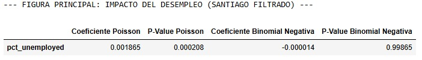

# Proyecto IELE756 - Región 13
**Equipo:** Mateo Estay y Roberto Verdejo 
**Región:** Región Metropolitana de Santiago (13)
**Descripción:** Análisis exploratorio de datos de migración y salud (Censo, ENO, GRD) para la RM.
# Proyecto Final: Una Anomalía, Defendida - IELE756


## 1. Comunas asignadas

- San Bernardo
- Calera de Tango

## 2. Anomalía detectada

Nuestra investigación aisló una anomalía metodológica en el pipeline de modelamiento de conteo regional: la variable de desempleo (`pct_unemployed`) presenta una inversión completa de signo y una pérdida total de significancia estadística al corregir la especificación del modelo desde un modelo Poisson hacia una regresión Binomial Negativa.

En el modelo Poisson, la variable `pct_unemployed` aparece como estadísticamente significativa, con un coeficiente de `0.001865` y un p-value de `0.000208`. Sin embargo, al utilizar una regresión Binomial Negativa, el coeficiente cambia a `-0.000014` y el p-value aumenta a `0.99865`, mostrando que la relación desaparece completamente.

La verificación mostró que esta diferencia se explica por una fuerte sobredispersión de los datos, donde la varianza era aproximadamente 1039 veces mayor que la media. Esto viola el supuesto principal del modelo Poisson, que espera que la media y la varianza sean similares. Por lo tanto, el resultado inicial no representa una relación real entre desempleo y enfermedades, sino una consecuencia de usar un modelo mal especificado.

## 3. Figura principal

La figura principal del análisis se genera en el notebook:

`notebooks/final_anomaly.ipynb`

La imagen utilizada para defender la anomalía se encuentra en:

`notebooks/headline.png`



Esta figura muestra que el modelo Poisson entrega una relación aparentemente significativa entre desempleo y tasas de enfermedad. Sin embargo, al corregir el modelo mediante una regresión Binomial Negativa, la relación pierde significancia estadística y deja de ser materialmente interpretable.

## 4. Instrucciones de ejecución

La figura principal y las verificaciones matemáticas de este hallazgo se generan directamente desde el notebook:

`notebooks/final_anomaly.ipynb`

El tiempo estimado de ejecución es menor a **5 segundos**, ya que el notebook consume directamente una tabla analítica precalculada en la Tarea 3 y no vuelve a ejecutar todo el pipeline desde cero.

### Instalación de dependencias

Para instalar las dependencias necesarias, ejecutar:

```bash
pip install -r requirements.txt
